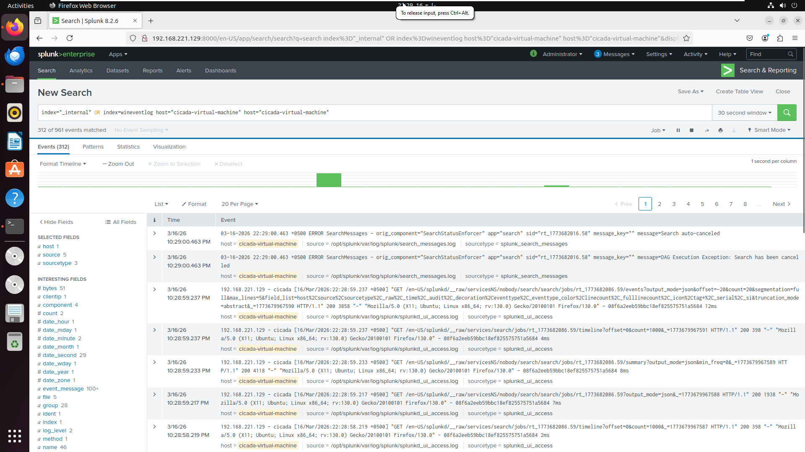

# Lab 2 — Windows 10 Log Ingestion to Splunk

## Objective
Send Windows Event Logs from Windows 10 VM to Splunk server using Universal Forwarder.

## System
- Windows 10 VM (192.168.221.128)
- Ubuntu Server with Splunk (192.168.221.129)

## Steps
1. Install Splunk Universal Forwarder on Windows 10  
2. Add Splunk server as forward-server (port 9997)  
3. Add monitors for Security, System, and Application event logs  
4. Restart Universal Forwarder  
5. On Splunk server, enable receiving on port 9997  
6. Verify logs in Splunk dashboard

## Result
Windows 10 logs successfully ingested into Splunk.

